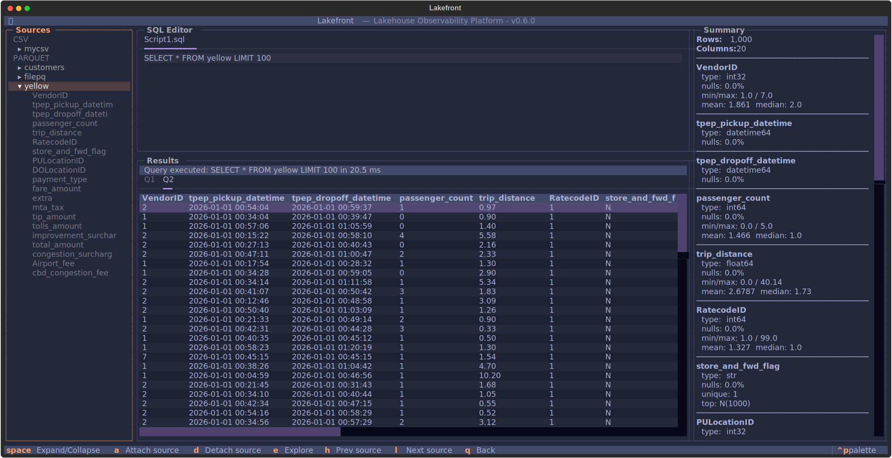

# Lakefront

A terminal-based lakehouse observability platform for exploring and managing data sources from your command line.

---

## About

Working with lakehouse data — Parquet files on local disk or S3, DuckDB queries, materialized views — usually means jumping between tools, writing throwaway scripts, or wrestling with heavyweight UIs. Lakefront puts it all in one place: a fast TUI and CLI for data engineers who live in the terminal.

**Problems it solves:**

- **No single tool for lakehouse exploration** — Lakefront combines DuckDB-powered SQL querying, S3 source management, and dataset browsing in one cohesive interface.
- **Configuration sprawl** — profiles let you switch between environments (local dev, staging, production S3) with a single command, keeping credentials out of your scripts.
- **Context switching** — instead of firing up a Jupyter notebook or a GUI just to peek at a Parquet file, you stay in the terminal.

---

## Examples

### Initialise Lakefront

Bootstrap the `~/.lakefront` directory structure and create a default profile:

```bash
uv run lakefront init
```

### Config Management

```bash
# List all profiles
uv run lakefront config list

# Show config directories and paths
uv run lakefront config info

# Create a new profile
uv run lakefront config create --profile staging

# Inspect a profile's current settings
uv run lakefront config inspect --profile staging

# See which profile is active
uv run lakefront config get-active

# Switch to a different profile
uv run lakefront config set-active --profile staging
```

Secrets (S3 access keys etc.) can be written to the TOML profile or
set via environment variables instead:

```bash
export LAKEFRONT_S3__ACCESS_KEY=...
export LAKEFRONT_S3__SECRET_KEY=...
```

### Project Management

Projects are the top-level organisational unit in Lakefront. Each project lives in its own directory under `~/.lakefront/projects/` and can be pinned to a config profile.

```
~/.lakefront/projects/
└── my-project/
    ├── project.toml      ← metadata + pinned profile
    └── results/          ← analysis outputs
```

```bash
# List all projects
uv run lakefront projects list

# Create a new project
uv run lakefront projects create my-project -d "EDA on S3 parquet" -p staging

# Inspect a project
uv run lakefront projects inspect my-project

# Delete a project (prompts for confirmation)
uv run lakefront projects delete my-project
uv run lakefront projects delete my-project --yes
```

### Source Management

Data sources are attached to a project and point to a local path or S3 prefix.

```bash
# Add a source
uv run lakefront projects source add -p my-project -n raw -k s3 --path s3://bucket/raw/
uv run lakefront projects source add -p my-project -n local -k local --path /data/parquet/

# Remove a source
uv run lakefront projects source remove -p my-project -n raw
```

---

## TUI (Terminal User Interface)

The interactive TUI provides a rich, multi-pane interface for exploring and analyzing data without leaving the terminal.



### Project Screen

The main project workspace with a three-pane layout:

**Left Pane — Data Sources:**

- Browse all attached sources with expandable tree view
- View column names and data types inline
- Quickly navigate between sources

**Center Pane — SQL Editor & Results:**

- Tabbed SQL editor for writing and managing multiple queries
- Syntax-highlighted editor with DuckDB SQL support
- **Ctrl+R**: Execute query
- **Ctrl+N**: Run query in a new results tab
- **Ctrl+S**: Save script to disk
- **Ctrl+T**: Create new editor tab
- **Ctrl+W**: Close current tab
- Results pane displays query output in scrollable tables

**Right Pane — Profiler:**

- Live query execution statistics
- Row counts, memory usage, and timing information

### Explore Screen

Deep-dive analysis with statistical profiling and AI insights:

- **Statistical Profile**: Automatic data profiling showing distribution, nulls, and cardinality
- **AI-Powered Insights**: Ask questions about your dataset using LLM integration
- **Interactive Q&A**: Type questions to get natural-language analysis and recommendations
- **Keyboard Shortcuts**:
  - **Ctrl+R** or Enter: Submit question to AI
  - **Q**: Return to project screen

### Navigation

- **Tab / Shift+Tab**: Move focus between panes
- Modal dialogs for source attachment and confirmations
- Themed UI with multiple color schemes (configurable via profile settings)

---
